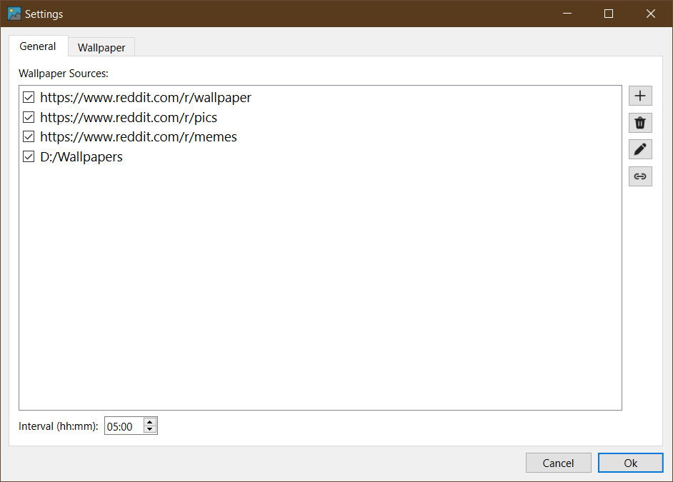

# wpcg-py - a simple random wallpaper changer

This project has started as a personal project and improvements have been made here and there because of lack of time. Do not expect frequent updates. It is still in beta but the application is usable in its current state.

wpcg-py is a random wallpaper changed developed in Python3 with Qt6 for the GUI. It shows you all the wallpapers in the defined directory randomly and never shows you a wallpaper twice, unless all the wallpapers were already shown. It does that by keeping a history of shown wallpapers in a Sqlite3 database.

It supports different wallpaper sources that can be enabled separately. Check the wiki for current sources.

Wallpaper 'beautification' is also available if enabled. This allows for images that do not fit the screens aspect ratio to be be repeated, blurred and or blended to create a better fitting wallpaper.

Currently supported operating Systems:
 * Windows 10/11 (others are not tested but might also work)
 * Linux [not tested _yet_] (Cinnamon, Gnome 3)

## [Download](https://github.com/JakobPer/wpcg-py/releases/tag/latest)

### Settings 
 

### Prettified wallpaper

 

# Building the app

Although it can be used as a standard Python script, I encourage you to create a binary and so you can easily add it to your startup programs.

Some build scripts are provided, though a better build system will be implemented sometime.

## Dependencies

install the `requirements.txt` with `pip install -r requirements.txt`

The project uses PyQt6 as an UI the UI framework but also had a dependency for pyside6 so we can use the resource compiler that comes with it. Hopefully this will not be necessary in the future.
 
### Linux

First install python3 and pip.

`sudo apt install python3 python-pip`

Then clone the project to a directory of your liking.

`git clone https://github.com/JakobPer/wpcg-py.git`

Navigate into the directory and create a python virtual environment to keep your standard environment clean.

`python3 -m venv .venv`

Activate the venv.

`source .venv/bin/activate`

If it is activated you see the venv name in front of your shell like `(.venv) user@host: `. After that install the dependencies.

`pip install -r requirements`

Generate the binaries with the provided build scripts.

`buid.sh`

The resulting binary will be in the dist folder.

Then you can add the binary to your startup projects

### Windows

For windows building is mostly similar. First install Python version >= 3.10 from the website.

Open a powershell and create the venv with

`python -m venv .venv`

Then activate it with

`.venv\Scripts\Activate.ps1`

Install the dependencies

`pip install -r requirements.txt`

Build the app with the build script

`.\build.ps1`

Binaries will also be in the dist folder

# Usage

Once started, it is only shown as a TrayIcon in the Taskbar. 
Double clicking the icon will change to the next wallpaper.
Right clicking opens a context menu where you can switch to the next or previous wallpaper, open the settings or exit the application.
In the settings you can the define the wallpaper directory and the interval in which the wallpapers should be changed automatically. 

# Development

If you want to contribute to the project, you can use VSCode or PyCharm as an IDE. The project files are checked in.

# License

```
wpcg-py, a simple wallpaper changer
Copyright (C) 2023  JakobPer

This program is free software: you can redistribute it and/or modify
it under the terms of the GNU General Public License as published by
the Free Software Foundation, either version 3 of the License, or
(at your option) any later version.

This program is distributed in the hope that it will be useful,
but WITHOUT ANY WARRANTY; without even the implied warranty of
MERCHANTABILITY or FITNESS FOR A PARTICULAR PURPOSE.  See the
GNU General Public License for more details.

You should have received a copy of the GNU General Public License
along with this program.  If not, see <https://www.gnu.org/licenses/>.
```
